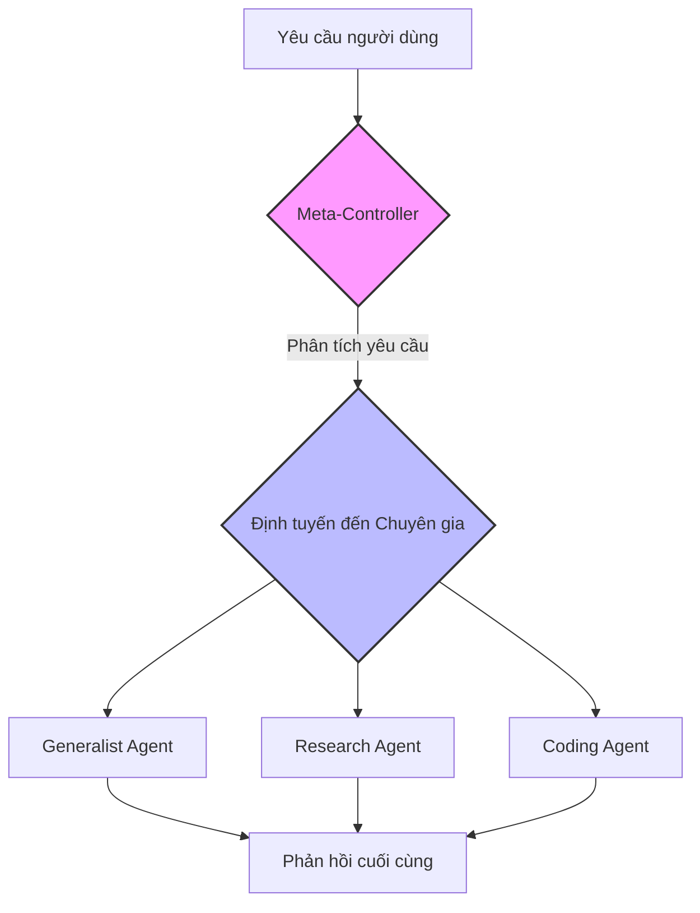

# All Agentic Architectures

     [](https://opensource.org/licenses/MIT)

Chào mừng bạn đến với lớp học chuyên sâu, thực hành về **thiết kế AI agent hiện đại**. Kho lưu trữ này chứa các bản triển khai chi tiết của **hơn 17 kiến trúc agentic tiên tiến**, được xây dựng bằng LangChain và LangGraph. Nó được thiết kế để trở thành một cuốn sách giáo khoa sống động, thu hẹp khoảng cách giữa các khái niệm lý thuyết và mã nguồn thực tế, sẵn sàng cho sản xuất.

## 📖 Tại sao lại có Kho lưu trữ này?

Lĩnh vực AI agent đang phát triển với tốc độ chóng mặt, nhưng nhiều tài nguyên vẫn còn mang tính trừu tượng và lý thuyết. Dự án này được tạo ra để cung cấp một lộ trình có cấu trúc, thực tế và mang tính giáo dục sâu sắc cho các nhà phát triển, nhà nghiên cứu và những người đam mê AI để nắm vững nghệ thuật xây dựng các hệ thống thông minh.

-   **Từ Lý thuyết đến Mã nguồn có thể chạm tới:** Mỗi kiến trúc không chỉ được giải thích mà còn được triển khai từ đầu đến cuối trong một Jupyter notebook có thể khởi chạy được.
-   **Lộ trình học tập có cấu trúc:** Các notebook được sắp xếp để xây dựng các khái niệm theo tiến trình, từ các pattern nền tảng đến các hệ thống đa agent và tự nhận thức cực kỳ nâng cao.
-   **Nhấn mạnh vào Đánh giá (Evaluation):** Chúng ta không chỉ xây dựng các agent, chúng ta đo lường chúng. Hầu hết các notebook đều có một pattern `LLM-as-a-Judge` mạnh mẽ để cung cấp phản hồi khách quan, định lượng về hiệu suất của agent, một kỹ năng quan trọng cho AI trong sản xuất.
-   **Các kịch bản thực tế:** Các ví dụ dựa trên các ứng dụng thực tế—phân tích tài chính, lập trình, quản lý mạng xã hội, sàng lọc y tế—làm cho các khái niệm trở nên liên quan ngay lập tức.
-   **Framework hiện đại, nhất quán:** Bằng cách sử dụng `LangGraph` làm bộ điều phối cốt lõi, bạn sẽ học được một cách tiếp cận mạnh mẽ, có trạng thái (stateful) và có chu kỳ (cyclical) đối với việc thiết kế agent, vốn đang nhanh chóng trở thành tiêu chuẩn của ngành.

---

## 🏛️ Các Kiến trúc: Một cái nhìn sâu sắc

Bộ sưu tập này bao gồm toàn bộ các thiết kế agentic hiện đại, từ việc cải tiến agent đơn lẻ đến các hệ thống đa agent phức tạp, cộng tác và tự cải thiện.

| # | Kiến trúc | Khái niệm cốt lõi / TL;DR | Trường hợp sử dụng chính | Notebook |
|:---:|---|---|---|:---:|
| **01** | **Reflection** | Chuyển từ một bộ tạo một lần sang một bộ lập luận đa bước có tính toán bằng cách phê bình và tinh chỉnh công việc của chính mình. | Tạo mã chất lượng cao, Tóm tắt phức tạp | [01_reflection.ipynb](./01_reflection.ipynb) |
| **02** | **Tool Use** | Trao quyền cho một agent để vượt qua giới hạn kiến thức và tương tác với thế giới thực bằng cách gọi các API và hàm ngoại vi. | Trợ lý nghiên cứu thời gian thực, Enterprise Bot | [02_tool_use.ipynb](./02_tool_use.ipynb) |
| **03** | **ReAct** | Đan xen linh hoạt giữa lập luận ("thought") và hành động ("tool use") trong một vòng lặp thích ứng để giải quyết các vấn đề phức tạp, đa bước. | Q&A đa bước, Điều hướng Web & Nghiên cứu | [03_ReAct.ipynb](./03_ReAct.ipynb) |
| **04** | **Planning** | Chủ động phân rã một nhiệm vụ phức tạp thành một kế hoạch chi tiết, từng bước *trước khi* thực thi, đảm bảo một workflow có cấu trúc và có thể truy vết. | Tạo báo cáo có thể dự đoán, Quản lý dự án | [04_planning.ipynb](./04_planning.ipynb) |
| **05** | **Multi-Agent Systems** | Một đội ngũ các agent chuyên biệt cộng tác để giải quyết một vấn đề, phân chia lao động để đạt được chiều sâu, chất lượng và cấu trúc vượt trội trong đầu ra cuối cùng. | Pipeline phát triển phần mềm, Brainstorming sáng tạo | [05_multi_agent.ipynb](./05_multi_agent.ipynb) |
| **06** | **PEV (Plan, Execute, Verify)** | Một vòng lặp tự sửa lỗi cực kỳ mạnh mẽ, nơi một agent Verifier kiểm tra kết quả của mỗi hành động, cho phép phát hiện lỗi và phục hồi động. | Tự động hóa rủi ro cao, Tài chính, Công cụ không đáng tin cậy | [06_PEV.ipynb](./06_PEV.ipynb) |
| **07** | **Blackboard Systems** | Một hệ thống đa agent linh hoạt, nơi các agent cộng tác một cách cơ hội thông qua một bộ nhớ trung tâm dùng chung ("blackboard"), được hướng dẫn bởi một bộ điều khiển động. | Chẩn đoán phức tạp, Hiểu biết động | [07_blackboard.ipynb](./07_blackboard.ipynb) |
| **08** | **Episodic + Semantic Memory** | Một hệ thống bộ nhớ kép kết hợp vector store cho các cuộc hội thoại trong quá khứ (episodic) và graph DB cho các sự thật có cấu trúc (semantic) để cá nhân hóa dài hạn thực sự. | Trợ lý cá nhân dài hạn, Gia sư cá nhân hóa | [08_episodic_with_semantic.ipynb](./08_episodic_with_semantic.ipynb) |
| **09** | **Tree of Thoughts (ToT)** | Giải quyết các vấn đề bằng cách khám phá nhiều lộ trình lập luận trong cấu trúc cây, đánh giá và cắt tỉa các nhánh để tìm ra giải pháp tối ưu một cách có hệ thống. | Câu đố logic, Lập kế hoạch có ràng buộc | [09_tree_of_thoughts.ipynb](./09_tree_of_thoughts.ipynb) |
| **10** | **Mental Loop (Simulator)** | Một agent kiểm tra các hành động của nó trong một "mô hình tâm trí" nội bộ hoặc bộ giả lập để dự đoán kết quả và đánh giá rủi ro trước khi hành động trong thế giới thực. | Robotics, Giao dịch tài chính, Hệ thống an toàn sống còn | [10_mental_loop.ipynb](./10_mental_loop.ipynb) |
| **11** | **Meta-Controller** | Một agent giám sát phân tích các nhiệm vụ đến và định tuyến chúng đến agent chuyên biệt phù hợp nhất từ một nhóm chuyên gia. | Nền tảng AI đa dịch vụ, Trợ lý thích ứng | [11_meta_controller.ipynb](./11_meta_controller.ipynb) |
| **12** | **Graph (World-Model Memory)** | Lưu trữ kiến thức dưới dạng biểu đồ (graph) có cấu trúc của các thực thể và mối quan hệ, cho phép lập luận đa bước phức tạp bằng cách duyệt qua các kết nối. | Tình báo doanh nghiệp, Nghiên cứu chuyên sâu | [12_graph.ipynb](./12_graph.ipynb) |
| **13** | **Ensemble** | Nhiều agent độc lập phân tích một vấn đề từ các góc nhìn khác nhau, và một agent "aggregator" cuối cùng tổng hợp các đầu ra của chúng để có một kết luận mạnh mẽ hơn, ít định kiến hơn. | Hỗ trợ quyết định rủi ro cao, Kiểm chứng sự thật | [13_ensemble.ipynb](./13_ensemble.ipynb) |
| **14** | **Dry-Run Harness** | Một pattern an toàn quan trọng nơi hành động đề xuất của một agent trước tiên được mô phỏng (dry run) và phải được phê duyệt (bởi con người hoặc bộ kiểm tra) trước khi thực thi trực tiếp. | Triển khai Agent trong sản xuất, Debugging | [14_dry_run.ipynb](./14_dry_run.ipynb) |
| **15** | **RLHF (Self-Improvement)** | Đầu ra của một agent được phê bình bởi một agent "editor", và phản hồi được sử dụng để sửa đổi công việc một cách lặp lại. Các đầu ra chất lượng cao được lưu lại để cải thiện hiệu suất trong tương lai. | Tạo nội dung chất lượng cao, Học tập liên tục | [15_RLHF.ipynb](./15_RLHF.ipynb) |
| **16** | **Cellular Automata** | Một hệ thống gồm nhiều agent đơn giản, phi tập trung dựa trên lưới, các tương tác cục bộ của chúng tạo ra hành vi toàn cục phức tạp và nảy sinh như tìm đường tối ưu. | Lập luận không gian, Logistics, Giả lập hệ thống phức tạp | [16_cellular_automata.ipynb](./16_cellular_automata.ipynb) |
| **17** | **Reflexive Metacognitive** | Một agent với "mô hình bản thân" lập luận về các khả năng và hạn chế của chính nó, lựa chọn hành động, sử dụng công cụ hoặc chuyển lên cho con người để đảm bảo an toàn. | Tư vấn rủi ro cao (Y tế, Pháp lý, Tài chính) | [17_reflexive_metacognitive.ipynb](./17_reflexive_metacognitive.ipynb) |

---

## 🗺️ Một chuyến tham quan có hướng dẫn qua các Kiến trúc

Kho lưu trữ được cấu trúc để đưa bạn vào một hành trình từ những cải tiến đơn giản đến việc xây dựng các hệ thống tự nhận thức, đa agent thực sự tinh vi.

<details>
<summary><b>Nhấp để mở rộng lộ trình học tập</b></summary>

#### Phần 1: Các Pattern Nền tảng (Notebook 1-4)
Phần này bao gồm các khối xây dựng thiết yếu để làm cho một agent đơn lẻ trở nên mạnh mẽ hơn.
- Chúng ta bắt đầu với **Reflection** để cải thiện chất lượng đầu ra.
- Sau đó, chúng ta cấp cho agent các **Công cụ (Tools)** để tương tác với thế giới.
- **ReAct** kết hợp những thứ này thành một vòng lặp động.
- Cuối cùng, **Planning** thêm khả năng nhìn xa trông rộng và cấu trúc cho các hành động của nó.

#### Phần 2: Cộng tác đa Agent (Notebook 5, 7, 11, 13)
Tại đây, chúng ta khám phá cách làm cho các agent làm việc cùng nhau.
- **Multi-Agent Systems** giới thiệu khái niệm về các nhóm chuyên biệt.
- **Meta-Controller** đóng vai trò là một bộ định tuyến thông minh để điều phối các nhiệm vụ đến các nhóm này.
- **Blackboard** cung cấp một không gian làm việc chung, linh hoạt cho sự cộng tác động.
- Pattern **Ensemble** sử dụng nhiều agent song song để phân tích chính xác và đa dạng hơn.

#### Phần 3: Bộ nhớ & Lập luận nâng cao (Notebook 8, 9, 12)
Phần này tập trung vào cách các agent có thể suy nghĩ sâu sắc hơn và ghi nhớ những gì chúng đã học.
- **Episodic + Semantic Memory** cung cấp một hệ thống bộ nhớ mạnh mẽ, giống như con người.
- **Graph World-Model** cho phép lập luận phức tạp trên các kiến thức liên kết với nhau.
- **Tree of Thoughts** cho phép khám phá nhiều con đường, có hệ thống để giải quyết các vấn đề logic khó.

#### Phần 4: An toàn, Tin cậy và Tương tác thực tế (Notebook 6, 10, 14, 17)
Những kiến trúc này rất quan trọng để xây dựng các agent có thể được tin cậy trong sản xuất.
- **Dry-Run Harness** cung cấp một lớp an toàn quan trọng với con người trong vòng lặp (human-in-the-loop).
- **Simulator** cho phép một agent "suy nghĩ trước khi hành động" bằng cách mô hình hóa các hệ quả.
- **PEV** xây dựng khả năng tự động phát hiện và phục hồi lỗi.
- Agent **Metacognitive** hiểu các giới hạn của chính nó, một chìa khóa để vận hành an toàn trong các lĩnh vực rủi ro cao.

#### Phần 5: Học tập và Thích ứng (Notebook 15, 16)
Phần cuối cùng khám phá cách các agent có thể cải thiện theo thời gian và giải quyết các vấn đề theo những cách mới lạ.
- **Self-Improvement Loop** tạo ra một cơ chế để agent học hỏi từ phản hồi, tương tự như RLHF.
- **Cellular Automata** cho thấy hành vi toàn cục phức tạp có thể nảy sinh từ các quy tắc cục bộ đơn giản như thế nào, tạo ra các hệ thống có khả năng thích ứng cao.

</details>

<details>
<summary><b>Sơ đồ kiến trúc ví dụ: Meta-Controller</b></summary>

Sơ đồ này minh họa luồng trong notebook `11_meta_controller.ipynb`, một pattern phổ biến để điều phối các agent chuyên biệt.


</details>

---

## 🛠️ Stack kỹ thuật & Thiết lập

Dự án này tận dụng một stack hiện đại, mạnh mẽ để xây dựng các ứng dụng AI tinh vi.

| Thành phần | Mục đích |
|---|---|
| **Python 3.10+** | Ngôn ngữ lập trình cốt lõi cho toàn bộ dự án. |
| **LangChain** | Cung cấp các khối xây dựng nền tảng để tương tác với LLM và công cụ. |
| **LangGraph** | Framework điều phối quan trọng để xây dựng các workflow agent phức tạp, có trạng thái và chu kỳ. |
| **Nebius AI Models** | Các LLM hiệu suất cao (ví dụ: `Mixtral-8x22B-Instruct-v0.1`) cung cấp sức mạnh cho việc lập luận của agent. |
| **Jupyter Notebooks** | Được sử dụng cho phát triển tương tác, giải thích phong phú và các bản trình diễn rõ ràng, từng bước. |
| **Pydantic** | Đảm bảo mô hình hóa dữ liệu có cấu trúc, mạnh mẽ, điều này rất quan trọng để giao tiếp tin cậy với LLM. |
| **Tavily Search** | Một API tìm kiếm mạnh mẽ được sử dụng làm công cụ cho các agent định hướng nghiên cứu. |
| **Neo4j** | Cơ sở dữ liệu graph tiêu chuẩn ngành được sử dụng để triển khai bộ nhớ semantic và world-model. |
| **FAISS** | Một vector store hiệu quả được sử dụng để triển khai bộ nhớ episodic thông qua tìm kiếm tương tự. |

## 🚀 Bắt đầu

Làm theo các bước sau để thiết lập môi trường cục bộ và chạy các notebook.

### 1. Clone Kho lưu trữ

```bash
git clone https://github.com/your-username/all-agentic-architectures.git
cd all-agentic-architectures
```

### 2. Thiết lập Môi trường ảo

Khuyên dùng môi trường ảo để quản lý các phụ thuộc (dependencies).

```bash
# Cho Unix/macOS
python3 -m venv venv
source venv/bin/activate

# Cho Windows
python -m venv venv
.\venv\Scripts\activate
```

### 3. Cài đặt các Phụ thuộc

Cài đặt tất cả các gói Python cần thiết từ file `requirements.txt`.

```bash
pip install -r requirements.txt
```

Để trực quan hóa các biểu đồ trong LangGraph, bạn cũng có thể cần cài đặt `pygraphviz`.

### 4. Cấu hình Biến môi trường

Các agent yêu cầu các API key để hoạt động. Tạo một file tên là `.env` trong thư mục gốc của dự án. Bạn có thể sao chép nội dung `requirements.txt` được cung cấp để xem những gì cần thiết và sau đó tạo file `.env` của mình.

Mở file `.env` và thêm thông tin đăng nhập của bạn. Nó sẽ trông như thế này:

```python
# file .env

# Nebius AI API Key (cho truy cập LLM)
NEBIUS_API_KEY="your_nebius_api_key_here"

# LangSmith API Key (cho tracing và debugging)
LANGCHAIN_API_KEY="your_langsmith_api_key_here"
LANGCHAIN_TRACING_V2="true"
LANGCHAIN_PROJECT="All-Agentic-Architectures" # Tùy chọn: Đặt tên dự án

# Tavily Search API Key (cho công cụ của Research agent)
TAVILY_API_KEY="your_tavily_api_key_here"

# Neo4j Credentials (cho các kiến trúc Graph và Memory)
# Bạn phải có một instance Neo4j đang chạy (ví dụ: qua Docker hoặc Neo4j Desktop)
NEO4J_URI="bolt://localhost:7687"
NEO4J_USERNAME="neo4j"
NEO4J_PASSWORD="your_neo4j_password_here"
```

### 5. Chạy các Notebook

Bây giờ bạn có thể khởi chạy Jupyter và khám phá các notebook theo thứ tự số.

```bash
jupyter notebook
```

## 🤝 Cách đóng góp

Sự đóng góp là những gì làm cho cộng đồng mã nguồn mở trở thành một nơi tuyệt vời để học hỏi, truyền cảm hứng và sáng tạo. Bất kỳ đóng góp nào của bạn đều được **trân trọng sâu sắc**.

1.  **Fork kho lưu trữ.**
2.  **Tạo một branch mới** cho tính năng hoặc bản sửa lỗi của bạn (`git checkout -b feature/new-architecture` or `bugfix/fix-typo`).
3.  **Thực hiện các thay đổi.** Vui lòng đảm bảo code được chú thích tốt và các giải thích trong notebook rõ ràng.
4.  **Gửi một pull request** với mô tả chi tiết về các thay đổi của bạn.

Bạn cũng có thể mở một issue để báo cáo lỗi, đề xuất cải tiến hoặc đề xuất một kiến trúc mới để thêm vào bộ sưu tập.

## 📄 Giấy phép

Dự án này được cấp giấy phép theo MIT License. Xem file [LICENSE](LICENSE) để biết thêm chi tiết.
